 ## mini_projet

 

 ## présentation 

 ceci est un présentation de projet de analyse d'une base donnée de TV , halftime shows et les grands jeux .
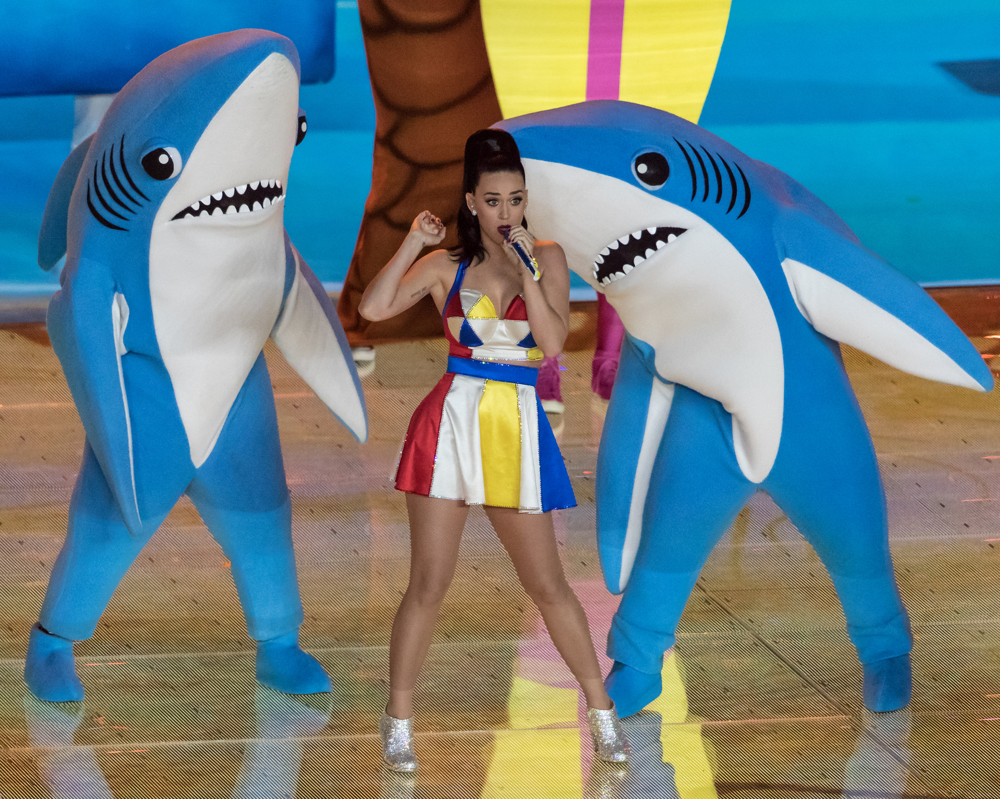
 on a utilisé la bibliothéque pandas 

  

  Loading the CSV data into DataFrames and Displaying the first five rows of each DataFrame
  
  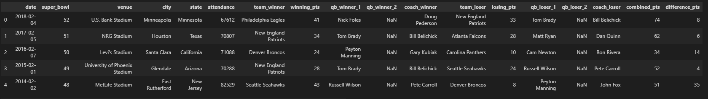
  
  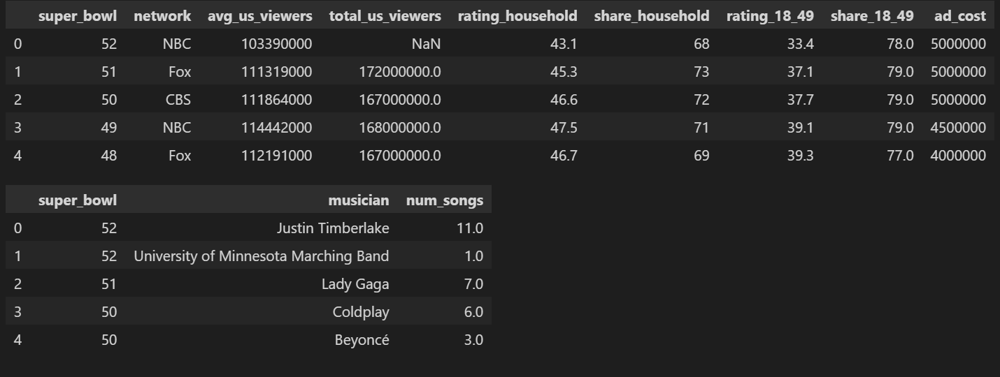

<h1>   full database </h1>
  Summary of the TV data to inspect and Summary of the halftime musician data to inspect

 
  super_bowl       | 53 non-null int64

network            | 53 non-null object
avg_us_viewers     | 53 non-null int64
total_us_viewers   | 15 non-null float64
rating_household   | 53 non-null float64
share_household    | 53 non-null int64
rating_18_49       | 15 non-null float64
share_18_49        | 6 non-null float64
ad_cost            | 53 non-null int64

<h3>we user also matplotlib in this project </h3>

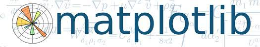

Plot a histogram of combined points
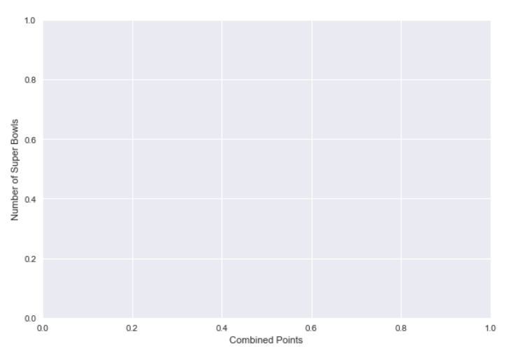
Displaying the Super Bowls with the highest and lowest combined scores

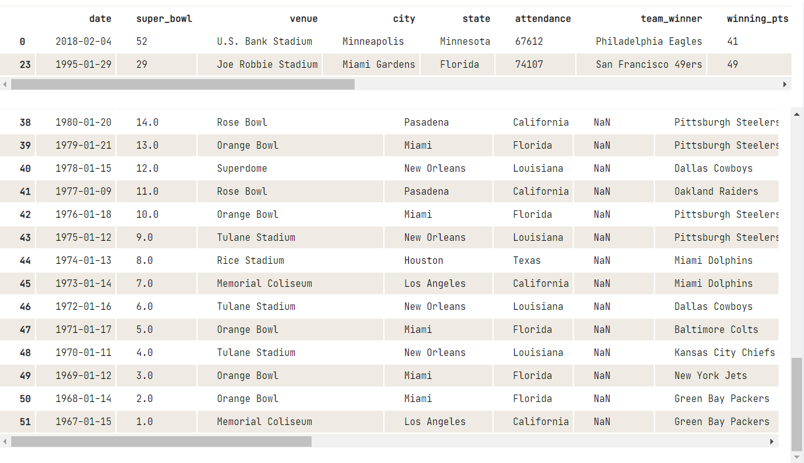

Plot a histogram of point differences

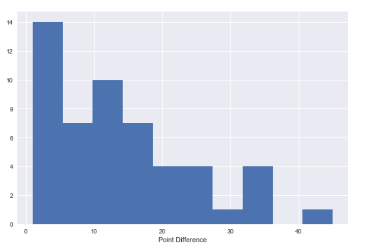

Displaying the closest games and biggest blowouts

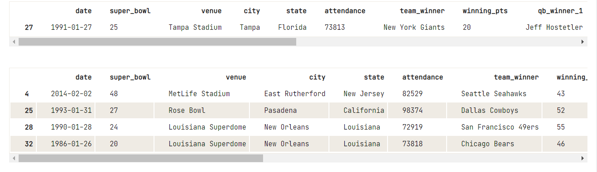

<h4> blowouts translate to the lost viewers</h4>

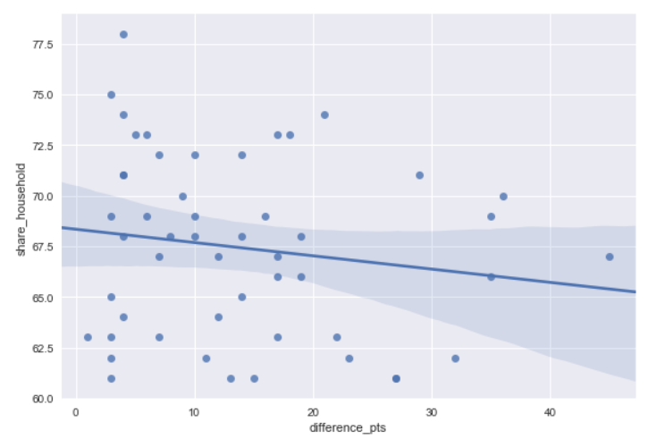

 <h4>Viewership and the ad industry over time</h4>
 Creating a figure with 3x1 subplot and activate the top subplot

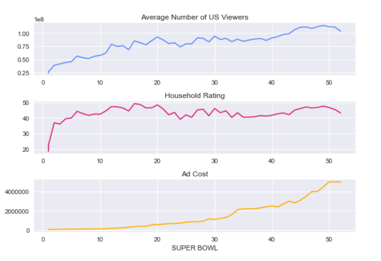

<h4>Halftime shows weren't always this great</h4>
 
Display all halftime musicians for Super Bowls up to and including Super Bowl XXVII

 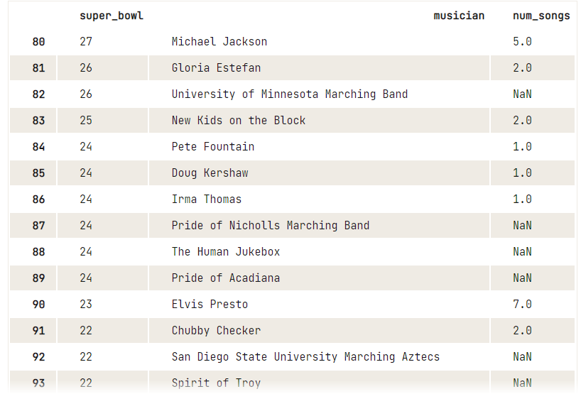

<h4>the most halftime show appearances</h4>
 Displaying musicians with more than one halftime show appearance

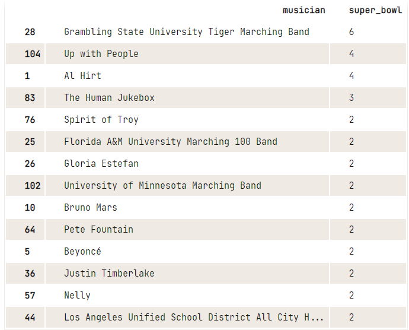

<h4>the most performed songs in a halftime show</h4>
 Plot a histogram of number of songs per performance

 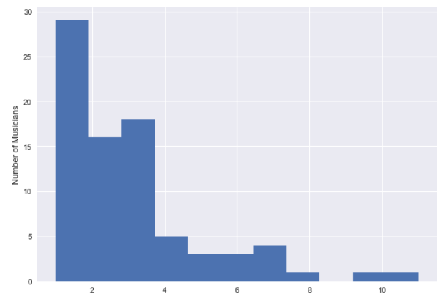

 the top 15 musician 

 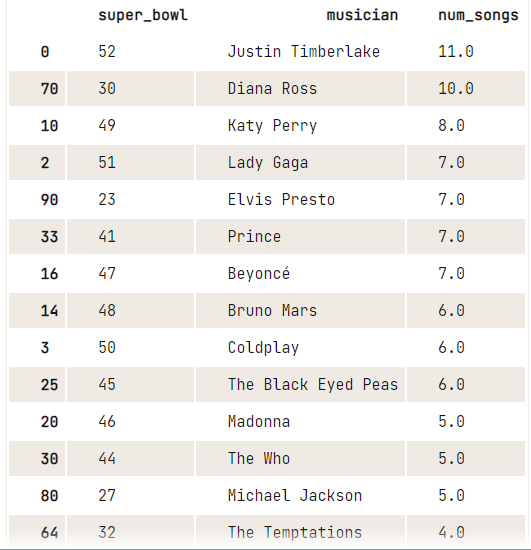

 <h3>conclusion</h3>

 <h5>The winner of Super Bowl LIII will be the New England Patriots</h5>

  